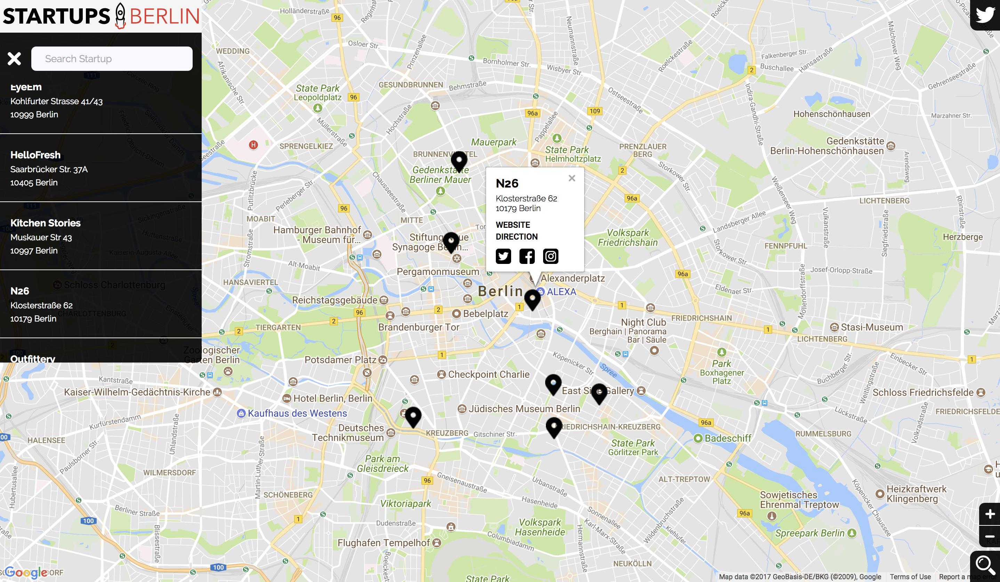

# Startup Map of Berlin 🦄
**Try it out:** [Explore the startup scene in Berlin. Let's go!](https://lohluc.github.io/berlin-startup-map/)

## Project
This is an interactive map of startups in Berlin by using the Google Maps API. Each marker shows location information and social media accounts of each startup. The startup list in the navigation section can be searched for specific startup names by using the [knockout.js framework](http://knockoutjs.com/documentation/introduction.html).
With the three buttons in the bottom right corner of the map, you can choose between zoom in, zoom out or reset the map to default zoom.
The map is responsive and fits perfectly on every screen size.

## License
This project is licensed under the MIT License - see the [LICENSE.md](LICENSE.md) file for details.

## Follow up

If you enjoy reading my code, please consider to take a look on [Twitter](https://twitter.com/luclohr) 🙂
